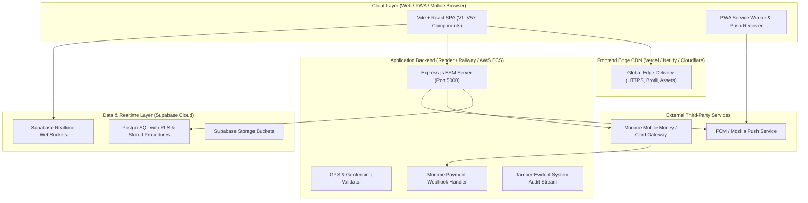

# V56: Production Deployment Guide & Infrastructure Runbook

This guide covers complete deployment instructions for taking the **Academic Management & Lecturer Portal (V1–V57)** into full production.

---

## Architecture Overview



---

## Step 1: Supabase Production Bootstrap

1. Create a production Supabase project at [https://supabase.com](https://supabase.com).
2. Go to **SQL Editor** in the Supabase Dashboard.
3. Open `supabase/v56_production_bootstrap.sql` from this repository.
4. Execute the script in its entirety. This will:
   - Create all production tables (`attendance_classes`, `attendance_logs`, `assignment_tasks`, `assignment_submissions`, `grade_records`, `grade_audit_logs`, `dissertation_registrations`, `dissertation_submissions`, `class_schedules`, `secure_messages`, `user_notifications`, `monime_payment_logs`, `system_audit_logs`).
   - Enable Row-Level Security (RLS) policies on all tables.
   - Install authoritative functions: `haversine_distance()`, `verify_and_log_attendance()`, `publish_module_grades()`.
   - Seed core reference tables with initial modules and configuration.
5. In **Storage**, create public/private buckets:
   - `assignment-files` (Restricted to authenticated lecturers/students)
   - `dissertation-drafts` (Restricted to candidate & assigned supervisor)
   - `avatar-uploads` (Public read)

---

## Step 2: Backend API Deployment (Render / Railway / AWS)

### A. Environment Configuration
Copy `server/.env.production.example` into your host environment variables:
- `PORT`: `5000` (or host-assigned `$PORT`)
- `NODE_ENV`: `production`
- `ALLOWED_ORIGIN`: Your frontend production domain (e.g. `https://portal.youruniversity.edu`)
- `SUPABASE_URL`: Project URL from Supabase Project Settings
- `SUPABASE_SERVICE_ROLE_KEY`: Service role secret key (never expose to client)
- `MONIME_API_KEY`, `MONIME_SPACE_ID`, `MONIME_WEBHOOK_SECRET`: Live API keys from Monime Dashboard
- `VAPID_PUBLIC_KEY`, `VAPID_PRIVATE_KEY`, `VAPID_SUBJECT`: Web Push keys generated via `web-push generate-vapid-keys`

### B. Deploy Commands
- **Root Directory**: `server/`
- **Build Command**: `npm install`
- **Start Command**: `node index.js`

### C. Health Check Endpoint
Verify backend health after deployment:
```bash
curl https://api.youruniversity.edu/api/health
```
Expected response:
```json
{"status":"ok","version":"57.0.0","environment":"production"}
```

---

## Step 3: Frontend Deployment (Vercel / Netlify)

### A. Environment Variables
Set the following in your Vercel/Netlify dashboard under Project Settings > Environment Variables:
- `VITE_SUPABASE_URL`: Your Supabase Project URL
- `VITE_SUPABASE_ANON_KEY`: Your Supabase Anon/Public Key
- `VITE_API_URL`: `https://api.youruniversity.edu/api`
- `VITE_VAPID_PUBLIC_KEY`: Same public VAPID key configured on the server
- `VITE_MONIME_SPACE_ID`: Public Monime space ID

### B. Build Configuration
- **Framework Preset**: `Vite`
- **Build Command**: `npm run build`
- **Output Directory**: `dist`
- **Single Page App Routing**: Ensure rewrites are enabled for `/*` -> `/index.html`.

---

## Step 4: Monime Webhook Integration

1. Log into your [Monime Developer Portal](https://monime.io).
2. Add a new Webhook endpoint:
   - **URL**: `https://api.youruniversity.edu/api/payments/webhook`
   - **Events Subscribed**: `payment.succeeded`, `payment.failed`, `payout.completed`
3. Copy the Monime Webhook Secret and set it as `MONIME_WEBHOOK_SECRET` in your backend environment.

---

## Step 5: Verification & Smoke Test

Execute the automated release validation script to ensure 100% test passing and configuration sanity:
```bash
node scripts/prepare-release.js
```
This confirms that:
- All 10 modular views load and bind to their respective data providers.
- GPS Haversine calculations strictly enforce proximity.
- Grade management enforces individual student isolation with **zero GPA calculations**.
- Push notification payload dispatchers and Monime signatures validate correctly.
